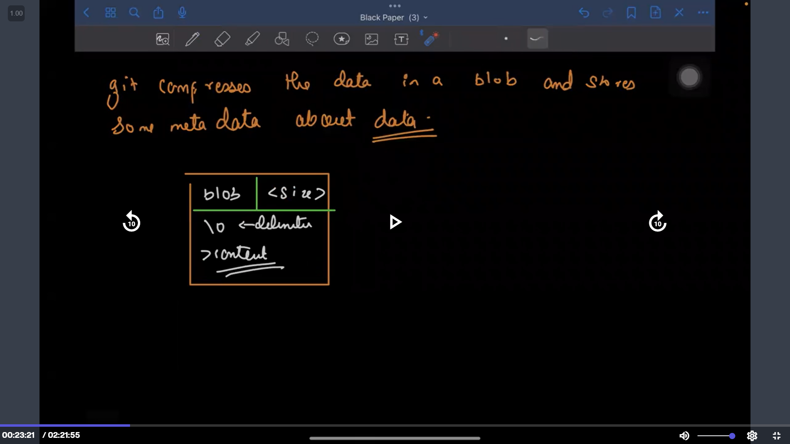
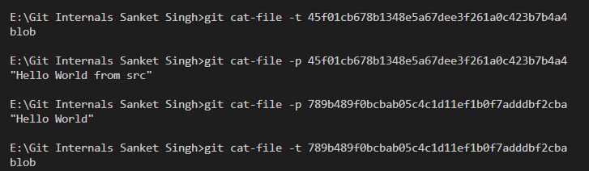
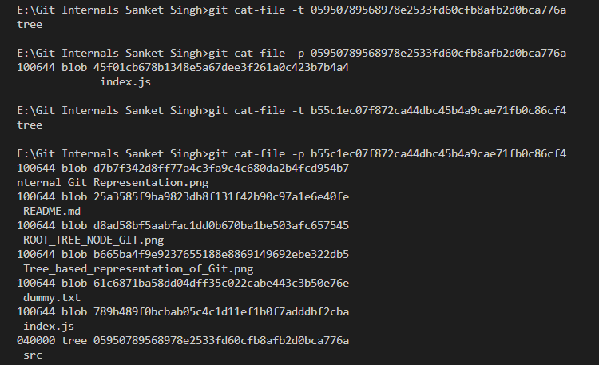
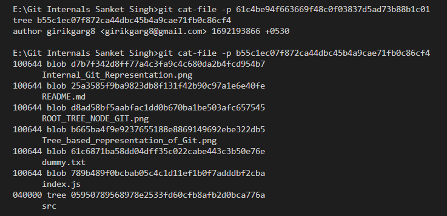
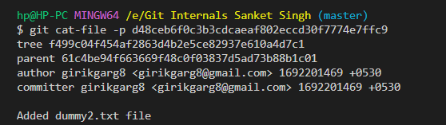
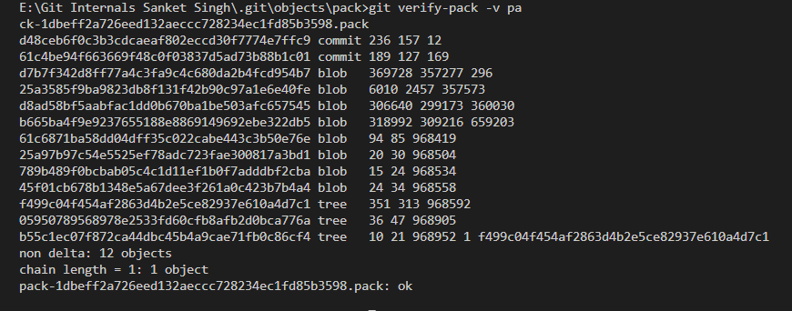

Git internally uses :

``` 
1. Hashing
2. Graph/Tree Data Structure
```

==> Git is like key-value store.

Key used is the hash of the data and value is the data.

The value is not directly stored, it is stored as a structure comprising of the blob, size, delimiter and actual content. [Discussed below]

git uses a cryptographic hash function -> SHA1 (Secure Hash Algorithm 1)

For a given data, it outputs 40 digit hexadecimal number. The hash value is always same for same data.

git compresses the data in a blob (binary large object), and stores some metadata about data.

The exact type of data (value) that git stores varies, explained below:

1. Blob Object: When you add a file to a Git repository, Git creates a blob object to store the content of that file. Blobs represent the actual content of files without any metadata or directory structure. A new blob object is created every time a file's content changes, even if the file's name remains the same.

2. Tree Object: When you add a directory to a Git repository, Git creates a tree object to represent the directory's contents and structure. A tree object contains references to other tree and blob objects, along with metadata such as filenames and mode permissions. This allows Git to represent the directory hierarchy.

3. Commit Object: When you make a commit in Git, it creates a commit object. A commit object represents a specific state of the repository at a given point in time. It includes references to the tree object representing the state of the repository's contents and information such as the author, committer, date, and commit message. If the commit has parent commits (as in the case of non-initial commits and merge commits), those are also referenced.

4. Tag Object: Tags in Git can be either lightweight or annotated. Annotated tags are represented using tag objects. These objects include information about the tagger, date, and an optional message. An annotated tag typically references a commit object that the tag points to.

Structure of how git stores the data:



Let's see the hashing of git in action :

Let's use ` echo 'Hello World' | git hash-object --stdin ` in GitBash or a Linux based shell. What this does is, it passes the string 'Hello World' and generates the 40 digit hexadecimal SHA1 hash, the same way git generates a hash when we commit a file.

We get 557db03de997c86a4a028e1ebd3a1ceb225be238 as the hash for 'Hello World' , regardless of how many times we run the command

Now, let's also try to write this hash, using the command ` echo 'Hello World' | git hash-object -w --stdin `, now if we go and see the .git/objects folder, we see a folder with intials '55' (first two digits of the hash) and a file inside it named '7db03de997c86a4a028e1ebd3a1ceb225be238' (the other digits of the hash).

So, this is technically what happens each time we move a file to the staging area. A unique hash is created by the SHA1 algorithm, and a folder is created inside the `.git/objects` folder, with the folder name as the first two initials of the hash, and a file with the name as the other characters of the hash.

Try this hands on: create a new file with some content, stage it with `git add <filename>`, and look at the contents of `.git/objects`, we'll see a folder and a file created.

We cannot read the contents of the object file using 'cat', as it is a binary file (blob), so the contents wouldn't be correctly printed on the screen. 

In order to read the contents of the object, we have a command called `git cat-file -p <hash>`, let's try this in action.

When we try the command `git cat-file -p 61c6871ba58dd04dff35c022cabe443c3b50e76e`, we see that the contents of the file are exactly same as the file dummy.txt, which proves that the content of the file is BLOB of the file dummy.txt

Till now, what we saw is only about how git manages a file using hashing...but if we see Git does many more things...

So, for example, we haven't talked about details of filenames, directory details, subdirectory details etc

Let's explore about how Git manages directory and subdirectory information !!

Git internally uses tree data structure (directed tree data structure) to maintain information about the directories, subdirectories etc

The tree has two types of pointers: a pointer to a blob (which is used when for compressing the contents of a file) and a pointer to a tree (this is used, for example, when a root node wants to point to to the child node i.e. the directory node wants to points to subdirectory node).

Git also stores the metadata like the type of pointer (blob/tree pointer), directory name and permissions associated with the files.

The permissions are always stored with the file when they are pushed...I have experienced this in action...so if a file is uploaded with the permissions 777 on Git, anyone who pulls that code also has the file with ther permission mode as 777

Let's consider a folder structure to understand this better...the folder structure is as follows

src
    - index.js [1] (Referred to as 1 henceforth)

index.js [2] (Referred to as 2 henceforth)

So, the root node for the tree would have two pointers, a pointer to node 2 (which would be a blob pointer) and a pointer to the src folder (which would be a tree pointer).


So, diagramatically this can be represented as: 


In the diagram above, we have also included some dummy hash IDs, for demonstration purpose.

So, this is how the overall tree (hierarchial structure) looks like. We have the root folder node, which then has different blob pointers and tree pointers, the tree pointers point to subdirectories and the blob pointers point to the blob of the actual data files.


61,b6,d3,d7,d8,25 -> 6 different git objects folder, which were already a part, apart from the folder structure mentioned in line 68

Using the command `git cat-file -t <hash id>`, we can see the type of file it is (blob/tree).

Our observations after making the folder structure:

1.  Once we stage the changes, objects with intials 45,78 appear after staging the folder structure. These are both blobs, and have the contents "Hello World" and "Hello World from src", respectively.



But we don't see the tree objects, we'll see them after committing (in the next step).

2. After committing, we see new objects with the initials 05,b5 and a new object with the id 61c4be94f663669f48c0f03837d5ad73b88b1c01.

On exploring them, I found that the object with initials b5 corresponds to the root node of the entire project structure, and has blob pointers to the various images, README.md, dummy.txt and most importantly a tree pointer to the src folder.

The object with initials 05 corresponds to the src folder, and has a blob pointer to the src/index.js file.

The object with the id 61c4be94f663669f48c0f03837d5ad73b88b1c01 has type as 'commit'. Now this is a new discovery, let's talk more about the commit object.

The commit object stores details such as, the author name, the email ID, commit message and a timestamp corresponding to the time when the commit was made.

It also contains a tree pointer, which points to that directory whose changes have been recorded during the commit.

Difference between author and committer (both author and committer are present in the commit object)

In Git, the "author" is the person who created the changes in a commit, while the "committer" is the person who added the commit to the repository. They can be the same, but in collaboration or open source, they might differ. The author's info is set when committing, and committer's info is set when adding to the repository.

Some other interesting observations about this commit object:

1. The commit object (or any other object) is based upon the content of the file, we hash. Now, the contents of two commits can never be the same, as the timestamps for two different commits would always be different.

2. The id for this object is same as the commit id, we can compare it from `git log`.




```
Let's also see what happens when there are several commits!!
```

We add a new file dummy2.txt and make a new commit with the object id: d48ceb6f0c3b3cdcaeaf802eccd30f7774e7ffc9

When we look at the contents of this object, we see a field 'parent' as well, so each commit also stores the parent commit (which in our case, is the first commit)



Let's also look at some of the optimizations that Git does, when we push our code to remote, to efficiently transfer the changes.

1. Delta Compression: Git uses delta compression to reduce the amount of data that needs to be transferred during a push. Instead of sending entire files, Git sends only the differences (or "deltas") between the versions of files that have changed. This minimizes the amount of data transmitted over the network.

2. Pack Files: Git uses a mechanism called "pack files" to store objects more efficiently. It groups similar objects together and stores them as compressed packs. This helps reduce the overall storage size of the repository and makes transferring objects faster.

Git does garbage collection whenever code is pushed to remote, we can also observe similar behaviour when we do `git gc`.

So, the next time you see the message 'Delta compression' when pushing code, you know what's happening behind the scenes :)

Also, observe that when we push the code to remote, the objects no longer remain in the .git folder, instead the packfiles remain

We can list what all commit IDs are present in the packfiles by using  `git verify-pack -v <path to packfile>`.

